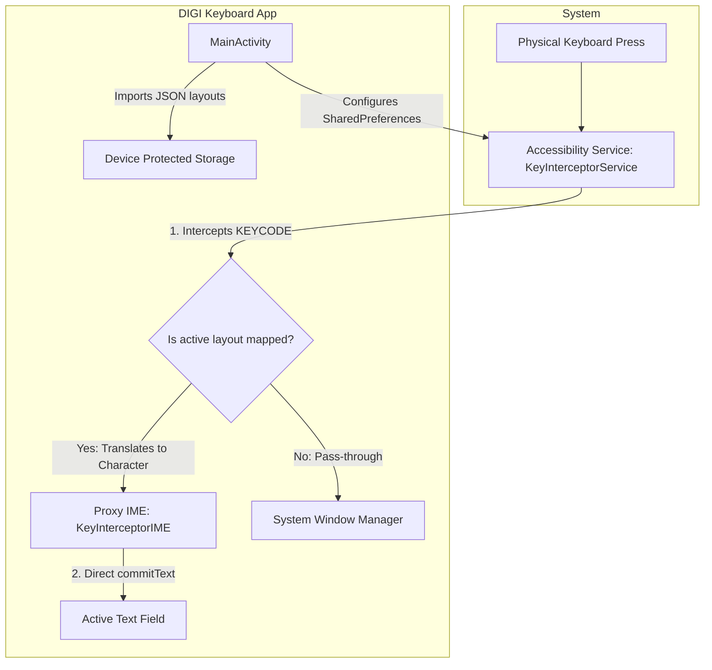

# Developer's Notes / Nota para Desarrolladores

This document provides a technical overview, architectural design, and operational context for developers who wish to maintain or extend the **DIGI Keyboard** project.

---

## 1. Project Context & Motivation / Contexto y Motivación

* **Target Device**: ZTE R2A TV Box (Android TV 14, API 34), distributed by the Spanish-Romanian provider **DIGI**.
* **Primary Use Case**: Allowing normal users to use physical keyboards on their provider-locked TV boxes without restrictions, seamlessly hot-swapping to an on-screen keyboard when the remote is used, and remapping remote buttons.
* **The "q/Q" Key Block Issue**: The telecom provider (DIGI) intercepted the physical `q` / `Q` key at the firmware level, assigning it to trigger a custom shortcut for their own VOD online streaming application. Consequently, the letter `q` became completely unavailable in all standard fields on the device.
* **Missing OS Settings**: The customized Android TV 14 ROM lacks physical keyboard layout selection menus and layout switching utilities.
* **The Solution**: 
  1. A low-level **Accessibility Service** (`KeyInterceptorService`) filters and captures key events at the system level before they reach the window manager.
  2. A zero-UI **Proxy Input Method Service** (`KeyInterceptorIME`) commits the translated characters directly to the active focus field.
  3. A **Smart Switcher** engine monitors `InputDeviceListener` and `AccessibilityEvent` focus changes to hot-swap between physical and on-screen IMEs on the fly.
  4. A **Catcher Mode** allows capturing generic remote hardware buttons and mapping them to Intents, Media Actions, or App launches.

---

## 2. Component Structure / Estructura de Componentes

The application comprises five main Kotlin classes and layout configurations:



### [KeyInterceptorService.kt](file:///c:/Users/kosty/AndroidStudioProjects/DiGI_R2A_Q/app/src/main/java/com/kostyamat/r2r_q/KeyInterceptorService.kt)
Acts as the central engine. It implements `AccessibilityService` and registers key event filtering:
* Captures keys inside `onKeyEvent()`.
* Listens for `Ctrl + Space` to cycle through the enabled layouts.
* Displays a transient HUD overlay (`WindowManager.LayoutParams.TYPE_ACCESSIBILITY_OVERLAY`) showing the selected layout's `shortName` (e.g., `ES`, `UA`).
* Checks the modifier states (`Shift`, `CapsLock`, and `AltGr` via `META_ALT_RIGHT_ON`).
* Performs the layout lookup and calls the Proxy-IME to inject the character.

### [KeyInterceptorIME.kt](file:///c:/Users/kosty/AndroidStudioProjects/DiGI_R2A_Q/app/src/main/java/com/kostyamat/r2r_q/KeyInterceptorIME.kt)
A headless `InputMethodService` (no layout, no graphical keyboard):
* Maintains a volatile singleton reference (`instance`).
* Exposes `commitTextDirectly(text: String)` which retrieves the active `InputConnection` and commits the characters instantly.
* Since standard accessibility injection is slow, this Proxy-IME ensures zero-latency typing.

### [MainActivity.kt](file:///c:/Users/kosty/AndroidStudioProjects/DiGI_R2A_Q/app/src/main/java/com/kostyamat/r2r_q/MainActivity.kt)
Controls layout configurations, active states, and onboarding steps:
* Renders active layout checkboxes.
* Loads layouts from the local assets folder and parses user-imported JSON layouts.
* Implements the Wizard buttons to open system keyboard settings, show the IME chooser, or open accessibility options.
* Auto-configures accessibility and IME parameters programmatically if the `WRITE_SECURE_SETTINGS` permission is present.

### [LayoutModel.kt](file:///c:/Users/kosty/AndroidStudioProjects/DiGI_R2A_Q/app/src/main/java/com/kostyamat/r2r_q/LayoutModel.kt)
Contains the data models `LayoutModel` and `KeyTranslation`. Maps keycodes to character mappings representing four states:
* `normal` (no modifiers)
* `shift` (Shift / CapsLock active)
* `altGr` (Right Alt active)
* `altGrShift` (Right Alt + Shift active)

---

## 3. Important Implementation Details / Detalles Importantes de Implementación

### Device Protected Storage Context
Because this application is deployed for kiosks and system billboards, it must run immediately upon booting (Direct Boot) before the user enters credentials. 
Therefore, `MainActivity` and `KeyInterceptorService` use:
```kotlin
createDeviceProtectedStorageContext()
```
This ensures they can read Shared Preferences and load layout JSONs from the disk even while the storage is encrypted in Direct Boot mode. All components are marked with `android:directBootAware="true"` in the manifest.

### API 34 Compatibility and Security Restrictions
* **IME lists lookup**: To obtain the enabled IME list on target SDK 34 (Android 14+), the app uses `InputMethodManager.getEnabledInputMethodList()` instead of `Settings.Secure.getString(..., ENABLED_INPUT_METHODS)`. The latter throws a `SecurityException` on API 34.
* **Restricted Settings**: If you sideload the release APK (e.g., from a USB drive), Android TV 14 will flag the app as an untrusted source and restrict access to its Accessibility Service (the toggle button in system settings will be disabled and greyed out). This must be overridden via ADB using the `appops` command detailed in the README.
